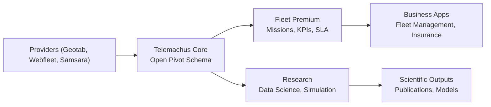

# Telemachus Core Specification

Welcome to the **Telemachus Core** documentation.  
This project defines an **open pivot format** for B2B telematics data (GNSS, IMU, CAN, Events, Context).  
It aims to unify fragmented data from providers (Geotab, Webfleet, Samsara, etc.) into a single, neutral schema.

## ❓ Why Telemachus?

- Open: A transparent and accessible format for all stakeholders.  
- Extensible: Designed to accommodate evolving telematics data types and sources.  
- Interoperable: Bridges diverse providers and systems under a unified schema.  
- Bridging science and business: Facilitates both research innovation and practical applications.

## 👥 Who is it for?

- Researchers: Access standardized data for analysis and modeling.  
- Developers/Integrators: Simplify integration with multiple telematics providers.  
- Fleet Operators/Insurers: Leverage consistent data for operations, monitoring, and risk assessment.

---

## 📚 Quick links
- 👉 [Introduction](01_introduction.md)
- 📖 [State of the Art](02_state_of_the_art.md)
- 📐 [Core Specification v0.1-alpha](03_spec_core.md)
- 🧪 [Examples](04_examples.md)
- 🧾 [JSON Schema](https://raw.githubusercontent.com/telemachus3/telemachus-spec/main/schemas/telemachus.schema.json)

---

## 🚀 Quickstart

Validate provided examples against the schema:

```bash
# Install ajv-cli and ajv-formats
npm install -g ajv-cli ajv-formats

# Validate all example files
ajv validate -c ajv-formats -s schemas/telemachus.schema.json -d "examples/*.json"
```

---

## 🌍 Vision

Telemachus wants to do for **telematics** what GTFS did for **public transport**:  
- Provide an **open, simple standard**.  
- Enable **interoperability** across providers.  
- Support both **scientific research** and **business applications**.  

---

## 🔗 Data Flow Overview



## 📖 Citation

If you use Telemachus in research or projects, please cite:

S. Edet (2025). *Telemachus Core Specification (v0.1-alpha)*.  
Zenodo. https://doi.org/10.5281/zenodo.17228092  

[](https://doi.org/10.5281/zenodo.17228092)